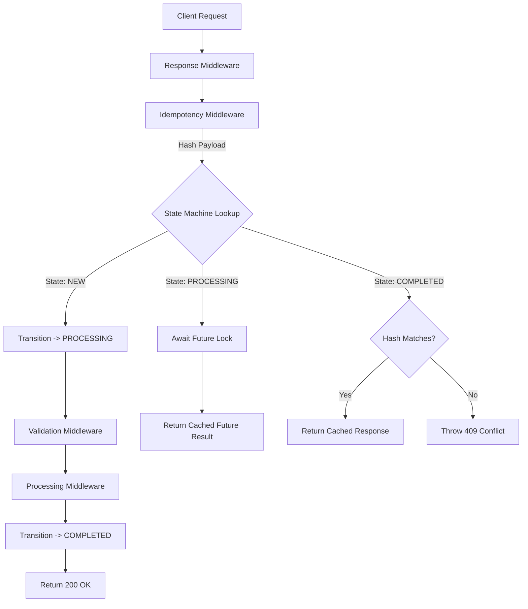

# Idempotency-Gateway (Middleware Pipeline + State Machine)

A fundamentally redesigned RESTful API gateway utilizing a **Middleware Pipeline** and an **In-Memory State Machine**. It guarantees idempotency by avoiding traditional controller-service patterns, using a high-throughput streaming architecture for handling race conditions and request lifecycles.

---

## Middleware Flow & State Transitions



---

## Setup Instructions

1. **Ensure Python 3.9+ is installed.**
2. **Create a virtual environment:**
   ```bash
   python -m venv venv
   source venv/bin/activate
   ```
3. **Install dependencies:**
   ```bash
   pip install -r requirements.txt
   ```
4. **Run the server:**
   ```bash
   python -m app.main
   ```
   The server will listen on `http://0.0.0.0:3000`. You can access it from your browser at `http://localhost:3000`.
5. **Run the tests:**
   ```bash
   pytest -v
   ```

---

## Testing with Swagger UI

FastAPI automatically generates an interactive Swagger UI. You can test the entire flow directly from your browser without Postman.

1. Start the server and navigate to `http://localhost:3000/docs` in your browser.
2. Click on the `POST /process-payment` endpoint to expand it.
3. Click **"Try it out"**.

### Example Test Flow

**1. First Request (New Key)**
* Fill in `Idempotency-Key`: `test-key-123`
* Fill in Request Body:
  ```json
  {
    "amount": 100,
    "currency": "USD"
  }
  ```
* Click **Execute**. 
* *Result:* The loader will spin for 2 seconds (simulated delay). You will receive a `200 OK` with `{"message": "Charged 100.0 USD"}`.

**2. Duplicate Request (Same Key + Same Body)**
* Leave the exact same `Idempotency-Key` and Body.
* Click **Execute** again.
* *Result:* It returns **instantly** (no 2-second delay). Scroll down to the response headers to see `x-cache-hit: true`.

**3. Same Key, Different Body (Conflict)**
* Leave `Idempotency-Key`: `test-key-123`
* Change the Request Body `amount` to `200`.
* Click **Execute**.
* *Result:* The server instantly rejects the request, returning a `409 Conflict` with `{"error": "idempotency_conflict", "message": "Idempotency key already used for a different request body"}`.

---

## Endpoint Reference

### `POST /process-payment`

**Headers:**
* `Idempotency-Key` *(string, REQUIRED)*: Unique identifier for the transaction.

**Request Body:**
```json
{
  "amount": 150.00,
  "currency": "USD"
}
```

**Responses:**
* **200 OK (First Request):** Successful charge.
* **200 OK (Duplicate):** Successful charge returned from cache (Includes `X-Cache-Hit: true` header).
* **400 Bad Request:** Missing header, invalid JSON, or invalid currency length.
* **409 Conflict:** Key exists but the request body is different.
* **500 Internal Error:** Unhandled exception downstream.

---

## Design Decisions

1. **FastAPI & Asyncio:** Chosen for extreme high concurrency. The event loop effectively acts as a Global Interpreter Lock for our in-memory store dictionary, natively providing a "first-writer-wins" setup.
2. **IStore Interface Architecture:** The application logic is uncoupled from the data storage technique. Swapping our `MemoryStore` out for a `RedisStore` requires changing only a single line in `main.py`.
3. **In-Flight Waiting Strategy:** If two identical requests hit the server at the exact same millisecond, the first request leaves an unresolved `asyncio.Future()` in the store. The second request binds to that Future, avoiding redundant CPU/database load downstream.
4. **Lexicographical Payload Hashing:** JSON bodies can be identically semantically but arrive in a different order. We recursively sort keys before hashing to guarantee a `100%` stable body hash.

---

## Extra Feature: TTL Background Sweeper

To prevent long-running memory leaks, `StoreEntry` structs are given an expiration timestamp. The application mounts an `asyncio` task on startup that wakes up every 60 seconds (configurable) to safely purge expired keys. This guarantees memory stability without dragging latency into the request cycle.